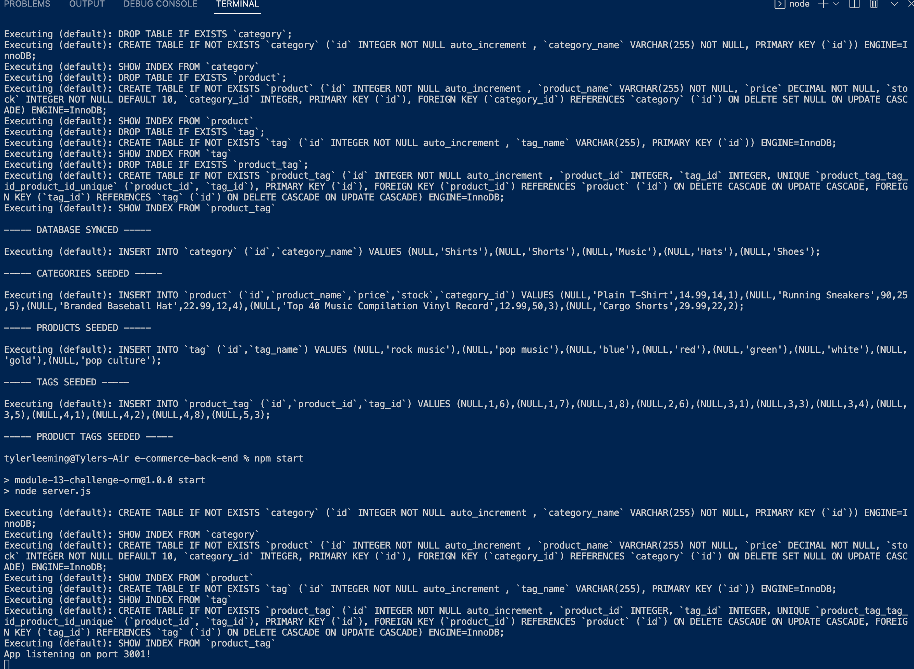
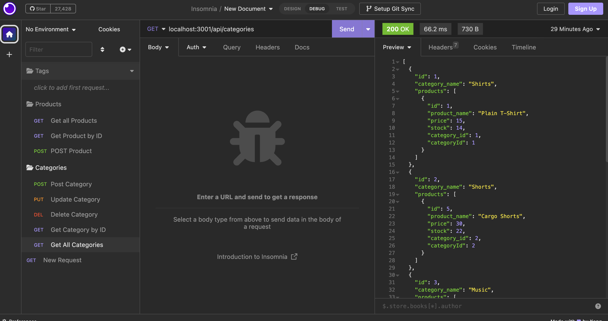
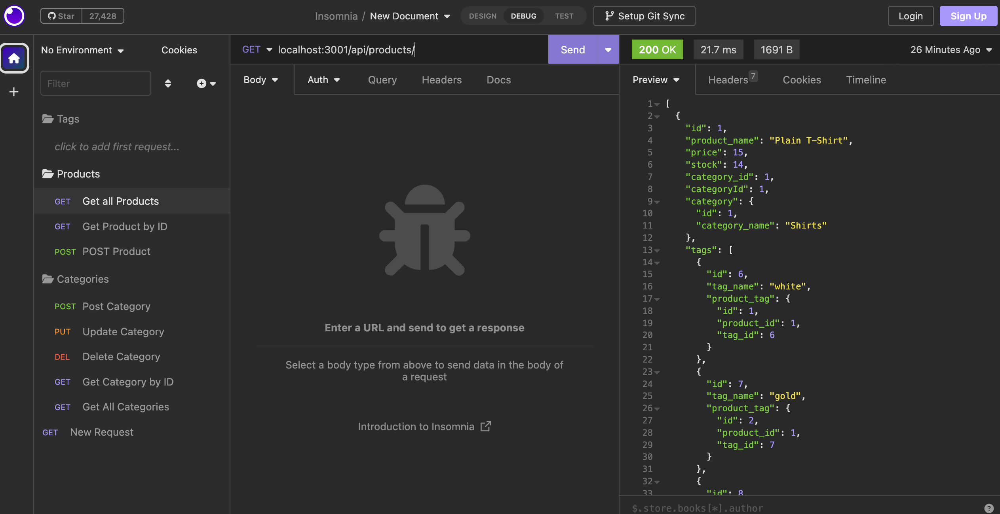

# e-commerce-back-end

## Description

This is an e-commerce back end application. This utilises a database in order to keep track of product from an store. This application would be highly useful for any modern store, particularly online stores. The application was developed with the following User Story:

### AS A manager at an internet retail company
* I WANT a back end for my e-commerce website that uses the latest technologies
* SO THAT my company can compete with other e-commerce companies

## Problems Solved
This application utilises databases to monitor supply of an e-commerce application. The user is able to add, delete, and change products depending on stock. The acceptanec criteria that the application completes are as follows:

* WHEN I add my database name, MySQL username, and MySQL password to an environment variable file
* THEN I am able to connect to a database using Sequelize
* WHEN I enter schema and seed commands
* THEN a development database is created and is seeded with test data
* WHEN I enter the command to invoke the application
* THEN my server is started and the Sequelize models are synced to the MySQL database
* WHEN I open API GET routes in Insomnia Core for categories, products, or tags
* THEN the data for each of these routes is displayed in a formatted JSON
* WHEN I test API POST, PUT, and DELETE routes in Insomnia Core
* THEN I am able to successfully create, update, and delete data in my database

## Usage

The following images show the completed website. You can view the walk through video by clicking [here.](https://watch.screencastify.com/v/5uJ4SRE7kJgAiLKoSdEt)

 

## Installation

Use the following commands:

Npm run seed

Npm start

## License

MIT

